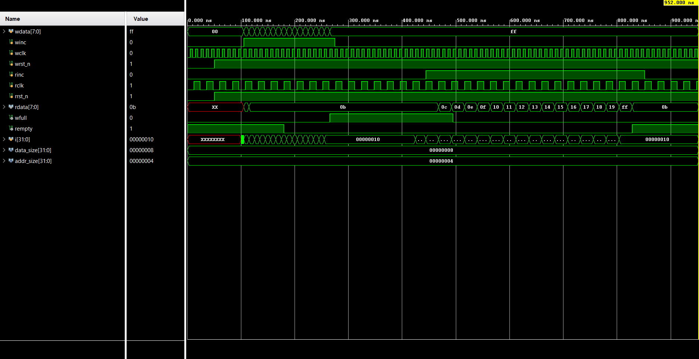

# Parameterized Asynchronous CDC FIFO

## 📌 Overview
This repository contains the Register-Transfer Level (RTL) design and verification of a fully parameterized **Asynchronous First-In-First-Out (FIFO)** buffer written in Verilog. 

In digital hardware design, passing multi-bit data between two independent, asynchronous clock domains (Clock Domain Crossing, or CDC) naturally leads to **metastability** and data corruption. This FIFO solves that problem by acting as an elastic buffer, isolating the read and write time zones. It utilizes N+1 bit Gray code pointers and dual-stage flip-flop synchronizers to guarantee flawless data transfer without data loss or glitches.

---

## 🏗️ System Architecture

### Key Hardware Features
* **Full Parameterization:** Both the data payload width (`data_size`) and the FIFO depth (`addr_size`) are easily configurable at the top level. The total memory depth is calculated as $2^{\text{addr\_size}}$.
* **Shared Dual-Port RAM:** Data is written synchronously and read combinationally, keeping the payload safely isolated from the synchronizers.
* **Gray Code Synchronization:** Binary memory pointers are translated into Gray code before crossing clock domains. Because only one bit changes state at a time, the risk of multi-bit metastability capturing invalid pointer data is eliminated.
* **Look-Ahead Flag Logic:** The `wfull` and `rempty` flags are generated using combinational look-ahead logic (calculating the *next* state) to ensure the flags raise instantly, preventing fatal memory overflows or underflows.

---

## 📁 Module Breakdown

All Verilog source files are located in the [`Code/`](Code/) directory.

| Module | Filename | Description |
| :--- | :--- | :--- |
| **Top Wrapper** | `top.v` | The structural top-level module. It connects the two independent clock domains and instantiates all sub-modules. |
| **Write Logic** | `wptr_full.v` | Operates on the Write Clock (`wclk`). Maintains the binary write pointer, converts it to Gray code, and generates the `wfull` flag. |
| **Read Logic** | `rptr_empty.v` | Operates on the Read Clock (`rclk`). Maintains the binary read pointer, converts it to Gray code, and generates the `rempty` flag. |
| **Memory Array** | `FIFO_memory.v` | The dual-port RAM block storing the data. Uses a synchronous write port and an asynchronous read port. |
| **Synchronizer** | `two_ff_sync.v` | A standard 2-stage flip-flop synchronizer. It acts as a physical shock absorber, safely pulling alien Gray code pointers into the local clock domain. |
| **Testbench** | `Test_Bench.v` | A comprehensive test environment generating isolated time zones, extreme memory bursts, and reset sequences to prove CDC reliability. |

---

## 📊 Simulation & Verification

The design was rigorously verified using a dual-clock Verilog testbench. The Write Clock (`wclk`) was set to a 10ns period (100 MHz), and the Read Clock (`rclk`) was set to a 24ns period (~41.6 MHz) to definitively prove the CDC crossing logic.

### Waveform Analysis
1. **System Reset:** At time 0, active-low resets clear all pointers. The `rempty` flag perfectly defaults to HIGH (`1`), preventing invalid data reads.
2. **The Write Burst:** Data is blasted into the FIFO back-to-back. Exactly on the 16th write, the look-ahead pointer logic triggers the `wfull` flag to snap HIGH, successfully shielding the memory from being overwritten.
3. **Clock Domain Latency:** As reading begins, the `wfull` flag remains HIGH for an extra cycle. This visually demonstrates the physical latency of the 2-stage synchronizer (`two_ff_sync.v`) as the updated read pointer travels across the silicon into the write domain.
4. **The Read Burst:** The consumer safely pulls data (`0a, 0b, 0c...`) out of the FIFO at a completely different frequency. No data is skipped, and no metastability glitches occur, proving the Gray code integration is highly robust.
